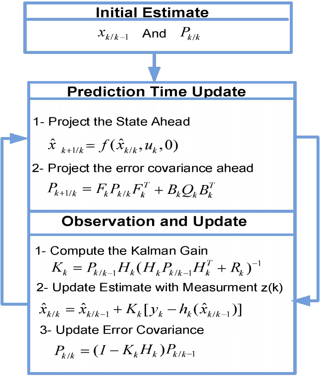

# State Estimation

When running on the track, our pod system is programmed to follow a certain sequence of states, as detailed on our state diagram. Successful performance of the pod demands an accurate, realtime estimate of the current state of the pod when running, as to know when to run certain commands and transition between states. The main obstacle in accurate state estimation is the time delay between sending out commands to various pod systems, and receiving sensory data on pod performance.

## Kalman Filters

### Description

From [Wikipedia](https://en.wikipedia.org/wiki/Kalman_filter): "In statistics and control theory, Kalman filtering, also known as linear quadratic estimation (LQE), is an algorithm that uses a series of measurements observed over time, containing statistical noise and other inaccuracies, and produces estimates of unknown variables that tend to be more accurate than those based on a single measurement alone, by estimating a joint probability distribution over the variables for each timeframe. The filter is named after Rudolf E. Kálmán, one of the primary developers of its theory.
The Kalman filter has numerous applications in technology. A common application is for guidance, navigation, and control of vehicles, particularly aircraft, spacecraft and dynamically positioned ships. Furthermore, the Kalman filter is a widely applied concept in time series analysis used in fields such as signal processing and econometrics. Kalman filters also are one of the main topics in the field of robotic motion planning and control, and they are sometimes included in trajectory optimization. The Kalman filter also works for modeling the central nervous system's control of movement. Due to the time delay between issuing motor commands and receiving sensory feedback, use of the Kalman filter supports a realistic model for making estimates of the current state of the motor system and issuing updated commands."

### Preliminary Notes

It seems that Kalman filters are the most suitable model to filter and process the sensory feedback from the pod to estimate what state our pod is in, integrating data from multiple sources. They have also been used in previous years. MIT's 2017 FDR mentions on pg. 96 about their use of an EKF (Extended Kalman Filter).

Kalman filters are able to account for any deviations in our sensor data, namely sensor drift and inaccuracies across sensors.

Below is a diagram from a previous year's PDB of the KF algorithm:

### Sensor Data

Refer to the [Specs](https://github.com/cornellhyperloop/software/tree/master/Specs) folder for more information about the modules. 

With data from the modules (fiducial detector, brake/low-speed module, front and rear analog modules, and our flight control module), we should be able to estimate the position, velocity and acceleration parameters of our pod that would be enough to allow us to estimate the pod state.  In reference to MIT's 2017 FDR, they also only used these parameters for state estimation.

### Research and Implementation

The difference between the Kalman Filter and the Extended Kalman Filter (EKF) is that while Kalman Filters deal with linear system models, EKFs deal with *non-linear* ones. We have a non-linear system model with pod, whose acceleration and velocity and position may not change linearly, so an EKF should be the most suitable. Specifically, a discrete-time EKF.

A diagram of operations and linear algebra in an EKF: 

In terms of implementing an EKF, there are several libraries in Python that may be useful. Numpy, scipy, and sympy are suitable for handling the linear algebra and statistical models required in the EKF algorithm. Furthermore, libraries like [Filterpy](https://filterpy.readthedocs.io/en/latest/kalman/ExtendedKalmanFilter.html) and [pykalman](https://pykalman.github.io/) have prexisting implementations of Kalman Filters and EKFs. More research needs to be done on which approach to take, however.

Useful links for implementation: 
* [Kalman Filter Explained With Python Code From Scratch](http://ros-developer.com/2019/04/10/kalman-filter-explained-with-python-code-from-scratch/)
* [Extended Kalman Filter Explained With Python Code From Scratch](http://ros-developer.com/2019/04/11/extended-kalman-filter-explained-with-python-code/)
* [https://towardsdatascience.com/kalman-filters-a-step-by-step-implementation-guide-in-python-91e7e123b968]
* [https://medium.com/@jaems33/understanding-kalman-filters-with-python-2310e87b8f48]

### Considerations + Future Steps

Our implementation of the Kalman Filter should include:
* measurements of response time between different points (issuing commands, receiving data, estimating state, reissuing updated commands)
* tests of overshooting time estimates
* tests of undershooting time estimates
* tests of false positives and false negatives

### Links
* [MIT FDR](http://zerocm.github.io/zcm/)
* [Wikipedia](https://en.wikipedia.org/wiki/Kalman_filter)

